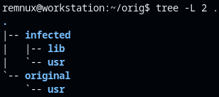
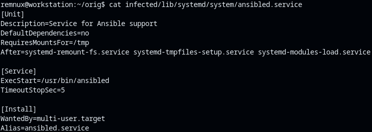
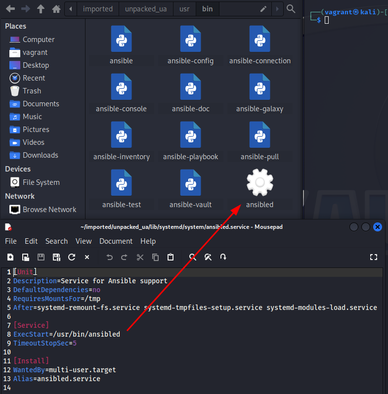
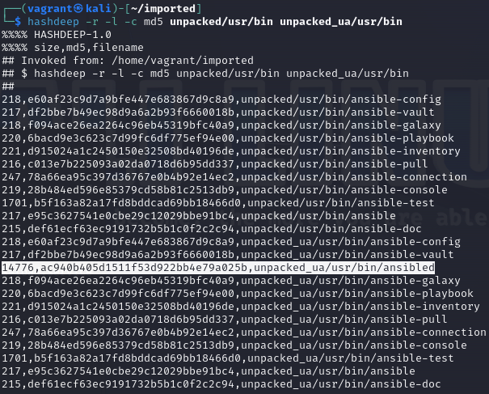
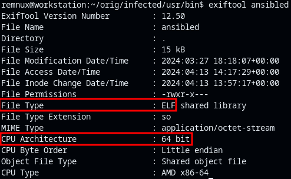
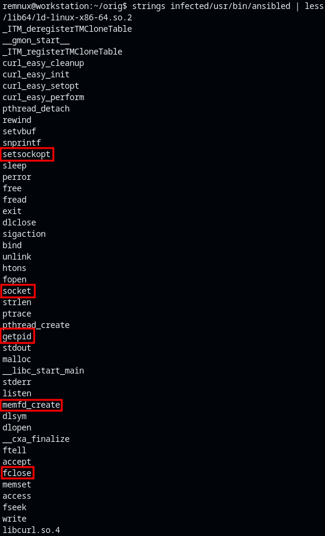
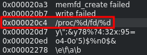

<!--
 Copyright 2024 David Araújo
 
 Licensed under the Apache License, Version 2.0 (the "License");
 you may not use this file except in compliance with the License.
 You may obtain a copy of the License at
 
     https://www.apache.org/licenses/LICENSE-2.0
 
 Unless required by applicable law or agreed to in writing, software
 distributed under the License is distributed on an "AS IS" BASIS,
 WITHOUT WARRANTIES OR CONDITIONS OF ANY KIND, either express or implied.
 See the License for the specific language governing permissions and
 limitations under the License.
-->

---
geometry: margin=25mm
title: Reverse Engineering - Suspicious Deb package
author: Tiago Silvestre - 103554, David Araújo - 93444
date: May XX, 2024
---

# Table of Contents
1. [Executive Summary](#executive-summary)
2. [Major Findings](#major-findings)
3. [Indicators of Compromise](#indicators-of-compromise)
4. [Description of the files](#description-of-the-files)

# Execute summary

<!-- TODO -->

# Major Findings

For this project, we were given a DEB file with the name *ansible-core_2.14.3-1+ua_all.deb*, and it is also said that "name and version do not match the original package". Because of this we search the internet for the original packaged named *ansible-core_2.14.3-1_all.deb*.

Using `dpkg-deb` to expose the content of both DEB files, when doing so we can clearly see that the one infected has an additional directory. Inside the *lib* directory there is a descriptor for a system service.

The important bit of this descriptor is the binary file it executes, explicit at `ExecStart=/usr/lib/ansibled`.

We can make sure that this is indeed an additional file an we are comparing the right packages by using the `deephash` tool to compare the hash of multiple files. Doing this reveals equal hash ensuring that this are indeed the same packages and that file is extra.

## Ansibled File Analysis

We start by using `exiftool` to discover the type of the file tna the CPU architecture for which is is intended run in. We can easily see that it is an ELF file intended to run at an x86 64bit architecture.

We also search for clear text using the `strings` tools.

We discover that whatever this binary does it will at least involve **sockets** and that gives us a **clue to search for information such as addresses and port numbers**. Not only that, it also handles some sort of **file writing and reading**, as well as the **suspicious search for process IDs** and the apparent access to a file with a given PID in the _/proc_ directory.

TODO