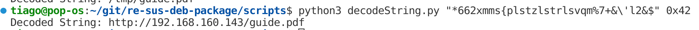

<!--
 Copyright 2024 David Araújo
 
 Licensed under the Apache License, Version 2.0 (the "License");
 you may not use this file except in compliance with the License.
 You may obtain a copy of the License at
 
     https://www.apache.org/licenses/LICENSE-2.0
 
 Unless required by applicable law or agreed to in writing, software
 distributed under the License is distributed on an "AS IS" BASIS,
 WITHOUT WARRANTIES OR CONDITIONS OF ANY KIND, either express or implied.
 See the License for the specific language governing permissions and
 limitations under the License.
-->

---
geometry: margin=25mm
title: Reverse Engineering - Suspicious Deb package
author: Tiago Silvestre - 103554, David Araújo - 93444
date: May XX, 2024
---

# Table of Contents
1. [Executive Summary](#executive-summary)
2. [Major Findings](#major-findings)
2.1 [Steps to Reproduce](#steps-to-reproduce)
3. [Indicators of Compromise](#indicators-of-compromise)
4. [Description of the files](#description-of-the-files)

# Execute summary

...

We used Ghidra to perform static analysis over `ansibled` binary file.

...

We found a method that was being called with a string and a byte passed as argument. Upon analysing this function we discovered that it was performing XOR operation with a key (byte value argument).

This function was deobfuscated in the following way

A python script was developed to test the function (available in `../scripts/decodeString.py/`),

As we can see it's converting translating into readable strings.
We ran that function over all references found in guidra and the following 3 unique strings were decoded:

