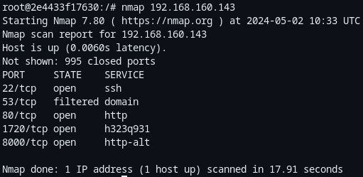

<!--
 Copyright 2024 David Araújo
 
 Licensed under the Apache License, Version 2.0 (the "License");
 you may not use this file except in compliance with the License.
 You may obtain a copy of the License at
 
     https://www.apache.org/licenses/LICENSE-2.0
 
 Unless required by applicable law or agreed to in writing, software
 distributed under the License is distributed on an "AS IS" BASIS,
 WITHOUT WARRANTIES OR CONDITIONS OF ANY KIND, either express or implied.
 See the License for the specific language governing permissions and
 limitations under the License.
-->

---
geometry: margin=25mm
title: Reverse Engineering - Suspicious Deb package
author: Tiago Silvestre - 103554, David Araújo - 93444
date: May XX, 2024
---

# Table of Contents
- [Table of Contents](#table-of-contents)
- [Execute summary](#execute-summary)
- [Major Findings](#major-findings)
  - [Ansibled File Analysis](#ansibled-file-analysis)
  - [Binary from PDF](#binary-from-pdf)
  - [Traffic Capture and Remote Communications](#traffic-capture-and-remote-communications)

# Executive summary
The purpose of this report is to show how a suspicious DEB package was analyzed. This DEB package labeled as *ansible-core_2.14.3-1+ua_all.deb* was being distributed inside the Campus. The package was not formally evaluated and the only information given was that the signature didn't match with the original package.

In order to analyze the package we used mainly the following tools:
- Ghidra - Static binary analysis.
- strace - Dynamic analysis.

During the analysis the methodology adopted was to use virtual machines whenever we executed the code present in the package.

We did some findings and discovered that it was downloading suspicius files from the internet, such PDF's with embedded ELF files.
The following section explains step by step how the DEB package was analyzed.

\pagebreak

# Major Findings

Given that the signatures were different, we conducted an internet search to locate the original package, identified as *ansible-core_2.14.3-1_all.deb*.

By utilizing `dpkg-deb` to extract the contents of both DEB files, we observed a notable distinction: the infected file contains an extra directory. Within the *lib* directory of the infected file, we discovered a descriptor for a system service.

The crucial aspect of this descriptor is the executable binary file it points to, explicitly specified as `ExecStart=/usr/lib/ansibled`.

We can verify that this is indeed an additional file and ensure we are comparing the correct packages by employing the `deephash` tool to compare the hash values of multiple files. This comparison reveals identical hash values, confirming that these are indeed the same packages and that the identified file is an extra component.

## Ansibled File Analysis
### Static analysis

We initiate the process by employing `exiftool` to ascertain the file type and the CPU architecture it is designed to run on. Our examination reveals that it is an ELF file intended for execution on an x86 64-bit architecture.

Additionally, we employ the `strings` tool to search for any clear text within the file.

We uncover that this binary is likely involved in operations related to **sockets**, indicating a potential need to search for information such as **addresses and port numbers**. Moreover, it appears to handle **file writing and reading tasks**, along with suspicious activities like searching for process IDs and accessing files associated with specific PIDs within the _/proc_ directory.

We also used Ghidra to perform a more detailed static analysis over `ansibled` binary.
Upon opening the binary we found a function being called multiple times (in different places of the code), this function received a string and a byte as argument. Upon analyzing it, we discovered that it was performing XOR operation with a key (byte value argument). 

This function was deobfuscated in the following way

A python script was developed to test the function (available in `../scripts/decodeString.py/`).
As we can see it's converting into readable strings.
We ran that function over all references found in ghidra and the following 3 unique strings were decoded:

### Dynamic analysis

Given the apparent involvement in reading and writing operations, we can infer the presence of **syscalls**. Consequently, we utilize `strace` to trace the execution and discern the accessed resources during runtime.

The initial observation reveals the binary attempting to access a file with an unconventional name, "_qhu*dkvlgi'a+ijfn,_" which is not found. Subsequently, it attempts to access this file again, along with another file named "guide.pdf" in the tmp directory.

The absence of these files suggests that they do not currently exist. This event seems to trigger the creation of a socket object.

As observed, the binary establishes a connection with the IP _192.168.160.143_ and proceeds to initiate a GET request to the endpoint _/guide.pdf_. From this sequence of actions, we can infer that initially, the binary was checking for the existence of this file. Upon not finding it, the binary transitions to attempting to download it.

Subsequently, the blocks highlighted in blue represent the response from the server containing the contents of the _guide.pdf_ file, with the binary then writing these contents to a file in the tmp directory.

After downloading the PDF file, the binary proceeds to read it, beginning from a predefined offset, as indicated by the `lseek` function in the second block. Subsequently, it writes the content to a new file named _ansibled_ using the _memfd\_create_ function.

Regarding the _memfd\_create_ function, here is the message from the man page:

> _"**memfd_create()** creates an anonymous file and returns a file descriptor that refers to it.  The file behaves like a regular file, and so can be modified, truncated, memory-mapped, and so on.  However, unlike a regular file, it lives in RAM and has a volatile backing storage.  Once all references  to  the  file  are  dropped,  it is automatically released."_

In the blue section, the path to this anonymous file is revealed as _/proc/3576/fd/5_. We can navigate to this location to retrieve the file, enabling us to analyze it further later on.

In the penultimate section (within the purple box), the binary creates a new file named ansibled.lock. Subsequently, it terminates a thread, then **elevates the privileges of the calling process by setting the effective user ID to 0** and adjusts the **real user ID, effective user ID, and saved set-user-ID of the calling process**.

Following this, in the green section, the binary enters an infinite loop, seemingly awaiting a remote connection through a socket.

\pagebreak

## Binary from PDF

Examining from the file _/proc/3576/fd/5_, we find out it is in fact another ELF binary file, and using `strings` we can find some interesting information.

Upon examination of the retrieved file, we discover significant textual references to **Telnet and SSH** sessions, along with **mentions of Busybox usage**. This insight suggests that the binary aims to utilize or directly manipulate the shell environment.

> _"BusyBox is a software suite that provides several Unix utilities in a single executable file. It runs in a variety of POSIX environments such as Linux, Android, and FreeBSD, although many of the tools it provides are designed to work with interfaces provided by the Linux kernel."_

Following that, we encounter what seems to be a list of strings potentially utilized for **User-Agent string manipulation**. This technique is commonly employed to **impersonate legitimate user traffic** or **evade detection** by mimicking authentic behavior, which might otherwise trigger blocking measures.

As we progress through the list of strings, we eventually observe the utilization of Busybox's tools for downloading another file from the **same IP address as the one from which the guide.pdf file**, which generated this binary, was downloaded. Furthermore, the binary not only runs from the _/tmp_ directory but also takes measures to clean the shell history, thus leaving no traces of its existence.

In the next section we can see the following:

- Lines 1-2: These lines appear to show memory addresses and then the names of corresponding programs. Busybox is a lightweight Unix-based operating system. Shell refers to the command line interface.

- Lines 4-9: These lines appear to show output messages that include placeholders, represented by "%s". These placeholders are likely filled with data about hacked devices, including their IP addresses, ports, usernames, and passwords.

- Lines 11-12: These lines reference "sh" and "shell" which are likely referring to the command line interface, where the commands to remove the temporary directory are being run.

- Lines 14-17: These lines reference processes being killed. "pkill" and "killall" are commands used to terminate processes.

- Lines 19-22: These lines appear to show output messages about a payload being sent, a device being infected and a device not being infected.

- Lines 24-27: This line appears to show a formatted string, potentially used in a HTTP request.

- Lines 29-30: These lines appear to be commands to clear the bash history, which is the log of commands entered into the command line interface.

Overall, the code appears to be designed to cover its tracks by deleting the command history. We can't however, be certain that that is its purpose.

Further evidence of this behavior is the use of _Paramiko_, which is a Python library that provides a comprehensive set of tools for working with Secure Shell (SSH) protocols. It allows Python programs to connect to, interact with, and manage remote servers securely over SSH.

Not only that, it download another file from a dynamical loaded address. This `scan.py` appears to accept three parameters: "376", "B", a string and "2".

Then, it will update the _/etc/resolv.conf_ file with two new nameserver addresses.

Finally, it clear not only the bash history but also the log of any users that may be using the system by deleting the _/var/log/wtmp_.

\pagebreak

## Traffic Capture and Remote Communications

Since from the start we noticed a pattern behavior of communications with a remote host, we decided to capture the traffic during one of our `strace` sessions.

This shown us information we already knew, namely the GET request for the PDF file. But also gave us a little more insight regarding the _SYN_ message sent every 5 seconds by the binary to the remote host.

The table shows that there were multiple attempts to establish a connection between the two devices. The first attempt (line 528) was initiated by the device with the IP address 172.17.0.2 (sandbox). However, the connection attempt was rejected by the device with the IP address 192.168.160.143 (line 529). The subsequent attempts (lines 530, 532, 533, and 535) were also unsuccessful.

Because of this, we tried a simple map of the host using `nmap`. Although this goes outside of the scope of this report, we could see that the port _8000_ was host a simple HTML page for what appeared to be a CTF contest.

We could've _fuzzed_ the remote host address with the goal of find some other available files, but then again, this would be outside of the scope and our interest was the _a.sh_ shell script and the _scan.py_ python script, and both of these are not available.